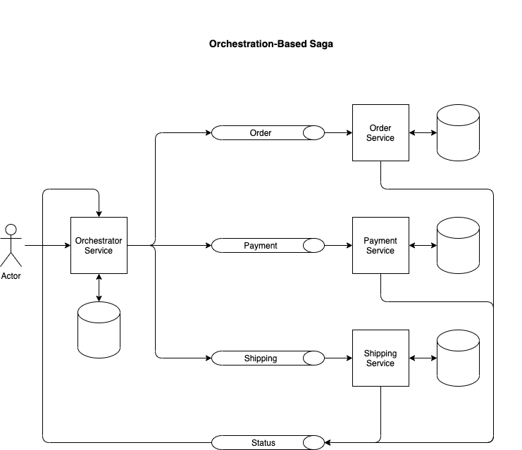

## Patrón saga con orquestación

En este ejemplo se ha desarrollado un ejemplo de patrón saga con orquestación como se muestra en la imagen:



Las tecnologias utilizadas para hacer el ejemplo son las siguientes:

- Quarkus
- Kafka
- Zookeeper
- Schema Registry
- MongoDB
- PostgresSQL

Solo tenemos que lanzar el siguiente comando para arrancar todos los contenedores:

```shell script
docker-compose up -d
```

Lo siguiente es generar los binarios de todos los servicios

```shell script
mvn clean install
```

Una vez generado los binarios podemos atacar el api del productor:

Abrimos 4 pestañas para arrancar cada servicio con el siguiente comando:

```
java -jar orchestrator-service/target/quarkus-app/quarkus-run.jar
java -jar order-service/target/quarkus-app/quarkus-run.jar
java -jar payment-service/target/quarkus-app/quarkus-run.jar
java -jar shipping-service/target/quarkus-app/quarkus-run.jar
```

> ### Api crear un order
>
> - Crear una order
>
>```shell script
>curl -v --request POST \
>--url http://localhost:8000/api/orders/ \
>--header 'Content-Type: application/json' \
>--data '{
>"userId":"1",
>"productId":"1",
>"price":100
>}'
>```
>Obtenemos la respuesta de la petición y buscamos el campo **Location**
>```
>Note: Unnecessary use of -X or --request, POST is already inferred.
>*   Trying ::1...
>* TCP_NODELAY set
>* Connected to localhost (::1) port 8000 (#0)
>> POST /api/orders/ HTTP/1.1
>> Host: localhost:8000
>> User-Agent: curl/7.64.1
>> Accept: */*
>> Content-Type: application/json
>> Content-Length: 45
>>
>* upload completely sent off: 45 out of 45 bytes
>  < HTTP/1.1 201 Created
>  < Content-Type: application/json
>  < Location: http://localhost:8000/api/orders/6131cba6149d3b0edb94dc89
>  < content-length: 0
>  <
>* Connection #0 to host localhost left intact
>* Closing connection 0
>```
>
> - Llamamos al endpoint para obtener el estado de la order
>
>```shell script
>curl --request GET \
>  --url http://localhost:8000/api/orders/6131cba6149d3b0edb94dc89 \
>  --header 'content-type: application/json' | jq
>```